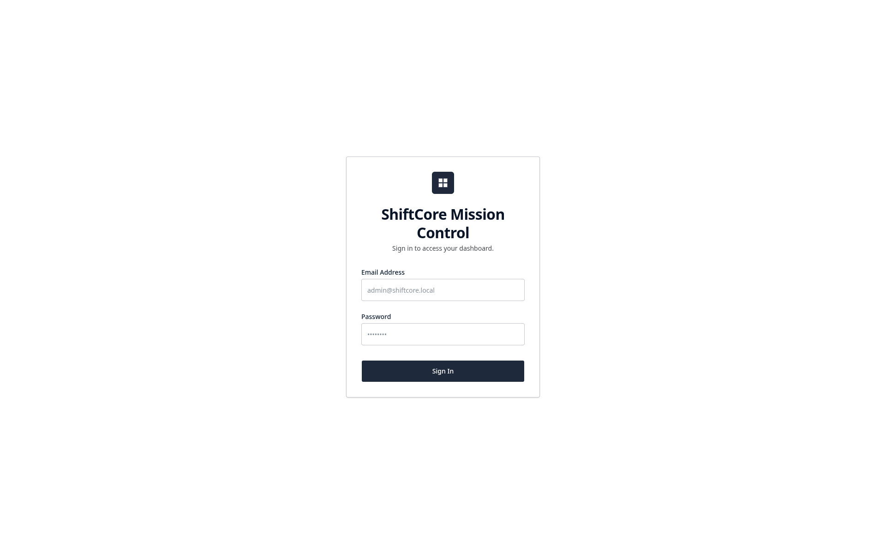
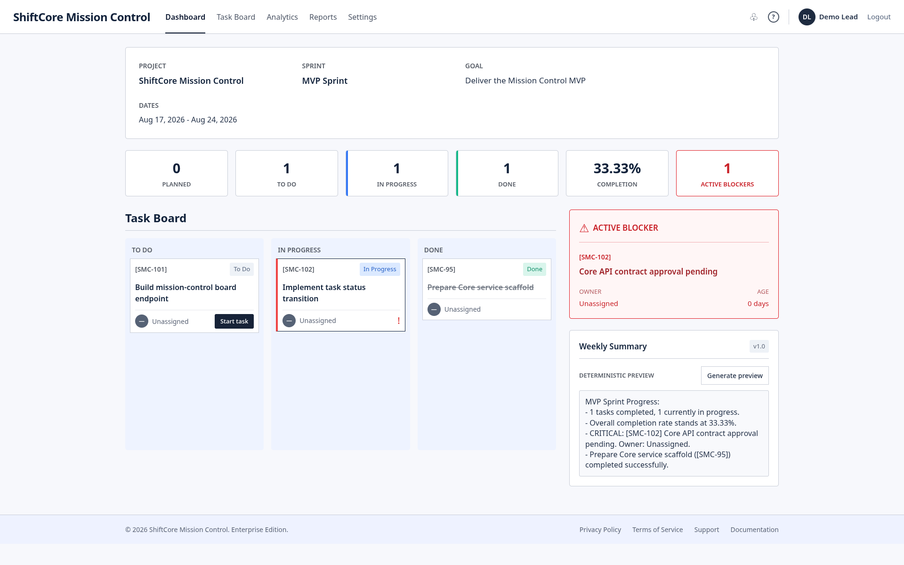
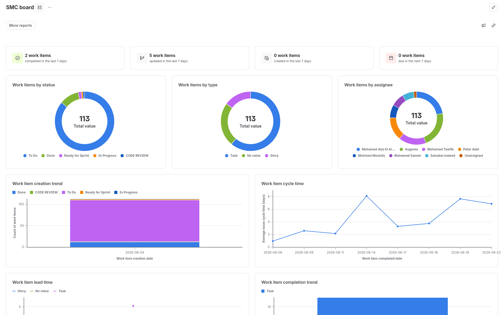
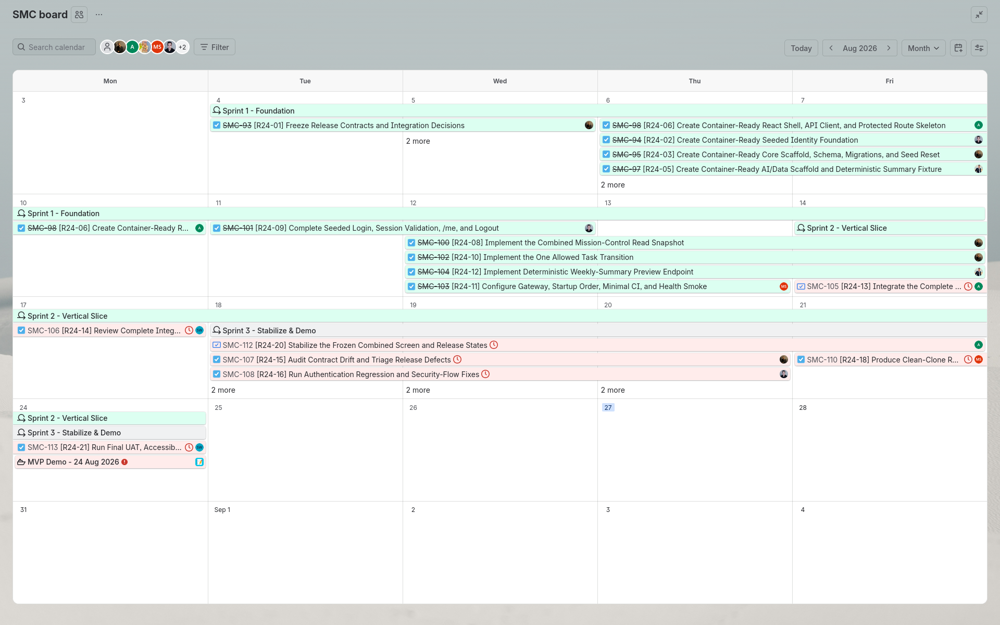
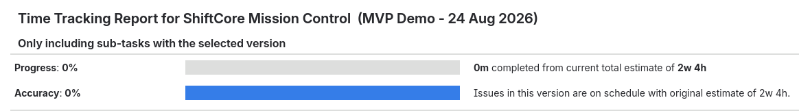

<div align="center">
  <h1>ShiftCore Mission Control</h1>
  <p>A release dashboard for tracking projects, sprints, tasks, blockers, delivery KPIs, and deterministic weekly summaries.</p>

  <p>
    <a href="https://platform.shiftcore.workers.dev/"></a>
    <a href="https://team-handbook-wq9.pages.dev/"></a>
    <a href="https://react.dev/"></a>
    <a href="https://dotnet.microsoft.com/"></a>
    <a href="https://nodejs.org/"></a>
    <a href="https://fastapi.tiangolo.com/"></a>
    <a href="https://www.postgresql.org/"></a>
    <a href="https://docs.docker.com/compose/"></a>
    <a href="LICENSE"></a>
  </p>
</div>

## Overview

ShiftCore Mission Control brings release information that is normally spread
across Jira, GitHub, chat, and meetings into one authenticated dashboard. The
completed MVP provides a project and sprint snapshot, a three-column task
board, blocker visibility, delivery KPIs, one allowed task transition, and a
deterministic weekly-summary preview.

The browser communicates only with the Nginx gateway. Identity issues an
RS256-signed JWT in an HttpOnly cookie; Core and AI/Data validate that session
locally with the public key and never receive the private key.

## Product Screens

### Sign in



### Mission Control dashboard



## Delivered Capabilities

- Seeded authentication with login, session validation, and logout.
- RS256 JWT signing and public-key verification across services.
- Combined project, sprint, task, blocker, and KPI snapshot.
- Three-column task board with a persisted `To Do` to `In Progress`
  transition.
- Deterministic weekly-summary preview with no external AI provider required.
- Versioned APIs behind a single Nginx gateway.
- PostgreSQL schemas managed independently by EF Core and Prisma migrations.
- Container health checks, startup ordering, seed workflows, and smoke tests.

## Architecture

```text
Browser
  |
  v
Nginx Gateway (:80)
  |-- /                    -> React Web (:3000)
  |-- /api/identity/v1/*   -> Identity API (:5001) -> identity schema
  |-- /api/core/v1/*       -> Core API (:4000)     -> core schema
  |-- /api/ai/v1/*         -> AI/Data API (:8000)
  `-- /health/*            -> service readiness

PostgreSQL (:5432)
  |-- identity schema (EF Core)
  `-- core schema (Prisma)
```

Internal service ports are not public application entry points. Browser and
review traffic should use the Nginx gateway.

## Technology Stack

| Layer | Technologies |
|---|---|
| Web | React 19, Vite 8, Tailwind CSS 4, Axios, React Router |
| Identity | ASP.NET Core 8 Minimal APIs, Entity Framework Core 8, BCrypt, RS256 JWT |
| Core | Node.js, Express 5, TypeScript, Prisma ORM 7, Joi |
| AI/Data | Python, FastAPI, Pydantic, deterministic summary provider |
| Data | PostgreSQL 16 with isolated `identity` and `core` schemas |
| Gateway | Nginx 1.27 |
| Runtime | Docker Compose |

## Services and Contributors

| Area | Path | Responsibility | Implemented by |
|---|---|---|---|
| Web application | `apps/web` | Login, protected navigation, Mission Control UI, task transition, summary preview | [Augesta Antar](https://github.com/augesta-antar) |
| UI/UX | `docs/assets` and product design | Login and Mission Control interface design | [Salsabil Waleed](https://github.com/silawaleed02-sudo) |
| Identity API | `services/identity` | Users, seed data, RS256 authentication, session cookie, EF Core migrations | [Mohamed Tawfik](https://github.com/tawfik0x00) |
| Core API | `services/core` | Mission snapshot, task transition, KPI aggregation, Prisma schema and seed | [Mohamed Mostafa](https://github.com/Cyb3R0xSASA) |
| AI/Data API | `services/ai` | Authenticated deterministic weekly-summary preview and API contract | [Peter Adel](https://github.com/0PeterAdel) |
| Infrastructure | `infra`, `docker-compose.yml`, `scripts` | PostgreSQL bootstrap, Nginx gateway, orchestration, health and release tooling | [Mohamed Sameh](https://github.com/mo7med20) |

## Repository Layout

```text
ShiftCore-Mission-Control/
├── apps/web/                 # React application
├── services/
│   ├── identity/             # ASP.NET Core Identity API
│   ├── core/                 # Express/TypeScript Core API
│   └── ai/                   # FastAPI AI/Data API
├── infra/
│   ├── nginx/                # Public gateway configuration
│   └── postgres/             # Database bootstrap scripts
├── contracts/                # OpenAPI contracts
├── docs/                     # Architecture and release assets
├── scripts/                  # Setup, key generation, DB, and smoke tools
├── docker-compose.yml        # Full-stack orchestration
└── setup.md                  # Setup, build, run, and verification guide
```

## Setup and Run

The complete Linux, macOS, and Windows instructions—including prerequisites,
JWT-key generation, build, startup, database seed, verification, logs, and
shutdown—are maintained in the **[Setup Guide](setup.md)**.

## Release Evidence

The verified MVP is published as
**[v0.1.0](https://github.com/Shift-Core/ShiftCore-Mission-Control/releases/tag/v0.1.0)**,
with the runtime evidence recorded in
**[Release Verification Issue #30](https://github.com/Shift-Core/ShiftCore-Mission-Control/issues/30)**.
Version `v0.1.1` is intentionally planned as a documentation and local-setup
follow-up; it has not been published yet.

The MVP demo was scheduled for 24 August 2026. Jira estimated the selected
release work at **2 weeks and 4 hours (`2w 4h`)**. The screenshots below are
point-in-time Jira planning/reporting evidence; their displayed progress may
not represent the repository's current completed state.

<details>
<summary>Jira delivery report</summary>



</details>

<details>
<summary>Jira release calendar</summary>



</details>

<details>
<summary>Jira time-tracking estimate</summary>



</details>

## Documentation

- [ShiftCore Website](https://platform.shiftcore.workers.dev/)
- [Mission Control Project Documentation](https://platform.shiftcore.workers.dev/docs/mission-control)
- [Setup Guide](setup.md)
- [Topology and Ownership](docs/topology-and-ownership.md)
- [Contributing Guidelines](CONTRIBUTING.md)
- [Identity Architecture](services/identity/ARCHITECTURE.md)
- [Identity Authentication](services/identity/docs/authentication.md)
- [Web Application](apps/web/README.md)
- [Core Service](services/core/README.md)
- [AI/Data Service](services/ai/README.md)
- [OpenAPI Contracts](contracts/)
- [Team Handbook](https://team-handbook-wq9.pages.dev/)
- [ShiftCore GitHub Organization](https://github.com/Shift-Core)
- [Project Wiki](https://github.com/Shift-Core/ShiftCore-Mission-Control/wiki)

## License

This project is licensed under the [MIT License](LICENSE).
