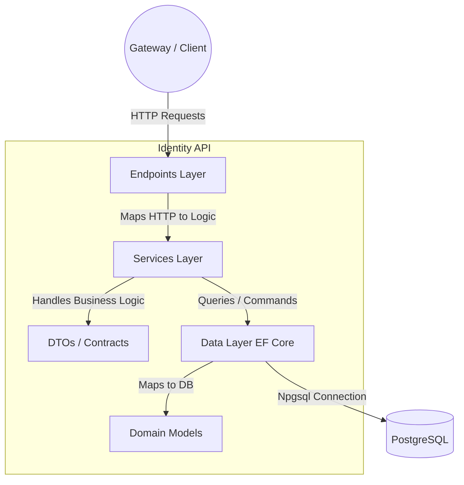
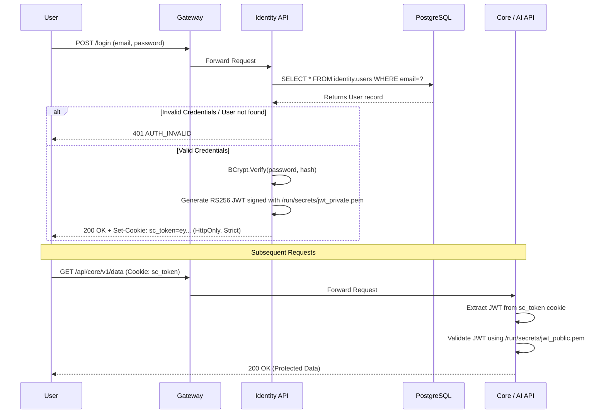

# Identity API: Architecture & Documentation

This document serves as the living technical documentation for the `.NET 8` Identity API and its Authentication/Authorization mechanisms within the ShiftCore Mission Control ecosystem.

---

## 1. System Architecture (Vertical Slice)

The API is built using a feature-based **Vertical Architecture** inside a single ASP.NET Core project.



### Layer Responsibilities
- **`Endpoints/`** — Minimal API handlers (`/api/identity/v1/auth/*`). Maps HTTP context to DTOs and back.
- **`Services/`** — `IAuthService` + `AuthService`: BCrypt hash verification, RS256 JWT generation, user profile extraction from claims.
- **`DTOs/`** — Request/response contracts. Enforces a strict `{ success, message, data }` JSON envelope.
- **`Data/`** — `ApplicationDbContext` (EF Core). Manages the `identity` schema in PostgreSQL via migrations.
- **`Models/`** — `User` entity mapped to `identity.users` table.

---

## 2. Authentication Flow

Uses **RS256 JWT** tokens injected into an `HttpOnly` cookie named `sc_token`.



### Security Highlights
| Mechanism | Purpose |
|---|---|
| `HttpOnly` cookie | JWT cannot be read by JS — prevents XSS |
| `SameSite=Strict` | Prevents CSRF attacks |
| `RS256` asymmetric crypto | Only Identity API holds the private key; all other services verify with the public key |
| BCrypt (cost 11) | Password hashes are slow-hashed and never stored in plain text |

---

## 3. Database Schema

The `identity` schema lives in the shared `shiftcore` PostgreSQL database. EF Core migrations (owned by this service) manage all DDL.

### `identity.users`

| Column | Type | Constraints |
|---|---|---|
| `id` | `UUID` | PK, `DEFAULT gen_random_uuid()` |
| `email` | `TEXT` / `VARCHAR(255)` | `NOT NULL`, `UNIQUE` |
| `name` | `TEXT` / `VARCHAR(255)` | `NOT NULL` |
| `password_hash` | `TEXT` | `NOT NULL` (BCrypt, cost 11) |
| `team_id` | `UUID` | `NOT NULL` |
| `role` | `TEXT` / `VARCHAR(50)` | `NOT NULL` |
| `is_active` | `BOOLEAN` | `NOT NULL DEFAULT TRUE` |
| `created_at` | `TIMESTAMPTZ` | `NOT NULL DEFAULT timezone('utc', now())` |
| `updated_at` | `TIMESTAMPTZ` | `NOT NULL DEFAULT timezone('utc', now())` |

### `identity.__EFMigrationsHistory`
Managed by EF Core. Records which migrations have been applied.

---

## 4. Database Ownership & Permissions

```
PostgreSQL role: identity_app
  CONNECT  → shiftcore database
  USAGE    → identity schema
  CREATE   → identity schema  (runs EF Core migrations)
  SELECT, INSERT, UPDATE, DELETE → identity.users
```

The `identity_app` role is **never** given `CREATEDB` or cross-schema access. It can only operate within its own `identity` schema.

---

## 5. API Reference

### Endpoints

| Method | Path | Auth | Description |
|--------|------|------|-------------|
| `GET` | `/health/identity` | No | Service health check |
| `POST` | `/api/identity/v1/auth/login` | No | Authenticate and set cookie |
| `GET` | `/api/identity/v1/auth/me` | Cookie | Get current user profile |
| `POST` | `/api/identity/v1/auth/logout` | Cookie | Clear the `sc_token` cookie |

### Response Envelope

**Success:**
```json
{ "success": true, "message": "...", "data": { ... } }
```

**Error:**
```json
{ "success": false, "message": "...", "errorCode": "AUTH_INVALID", "traceId": "..." }
```

---

## 6. Seeded Users (Local Dev Only)

Password for all: `Password123!`

| Email | Role | Purpose |
|---|---|---|
| `super@shiftcore.local` | `Super` | Platform-level access |
| `core@shiftcore.local` | `Core` | Core API / workflow owner |
| `identity@shiftcore.local` | `Identity` | Identity API / auth owner |

---

## 7. EF Core Migration Strategy

- Migrations are generated locally with: `dotnet ef migrations add <Name>`
- Applied **automatically on startup** via `dbContext.Database.Migrate()` in `Program.cs`
- Migration history is stored in `identity.__EFMigrationsHistory`
- Seeds are embedded in migrations using `HasData()` in `ApplicationDbContext.OnModelCreating`

> **Note:** `EnsureCreated()` was removed. The service never calls `CREATE DATABASE` — the database is pre-created by the Postgres bootstrap container (`infra/postgres/bootstrap/001-schemas-and-roles.sql`).
