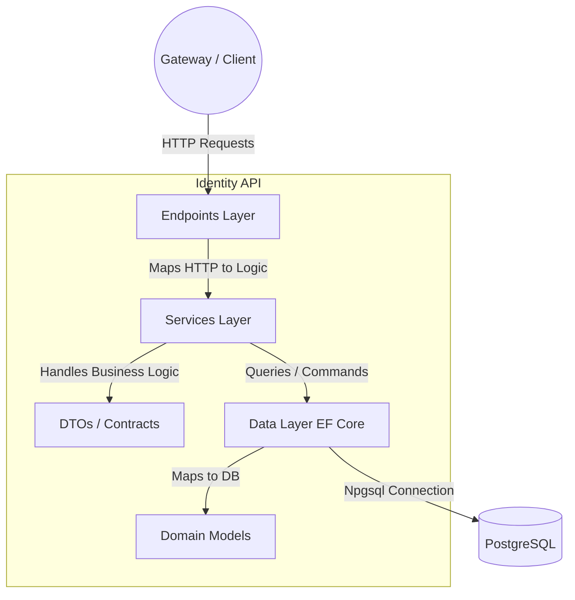
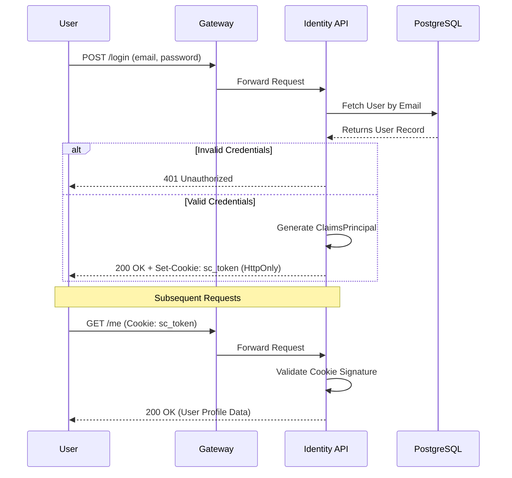
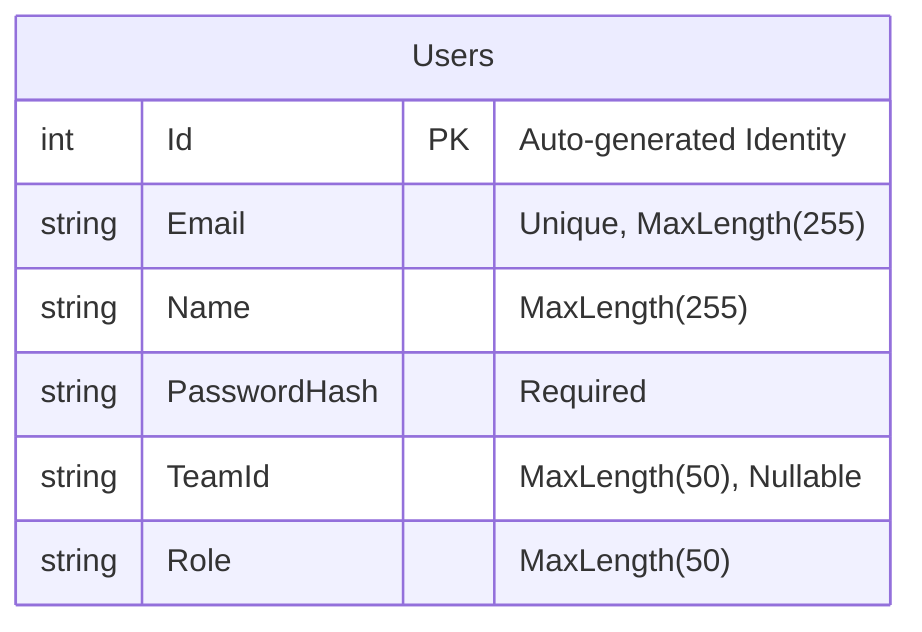

# Identity API: Architecture & Documentation

This document serves as the living report and technical documentation for the `.NET 8` Identity API and its Authentication/Authorization mechanisms within the ShiftCore Mission Control ecosystem.

---

## 1. System Architecture (Vertical Slice)

The API is built using a modern, feature-based **Vertical Architecture** inside a single ASP.NET Core project. This provides strict separation of concerns without the overhead of maintaining multiple class libraries.

### Layer Responsibilities:
- **`Endpoints/`**: Handles incoming HTTP routing (`/api/identity/v1/auth/*`) using Minimal APIs. Converts HTTP Context to strongly-typed DTOs.
- **`Services/`**: Contains interfaces (`IAuthService`) and implementations (`AuthService`) encapsulating the core business logic (e.g., verifying hashes, generating claims).
- **`DTOs/`**: Shared Data Transfer Objects ensuring a strictly enforced JSON envelope contract (`{ success, message, data }`) for the frontend.
- **`Data/` & `Models/`**: Entity Framework Core `DbContext` and domain entities. Handles direct persistence logic.

---

## 2. Authentication Flow

We utilize a highly secure **Cookie-Based Authentication** flow, leveraging ASP.NET Core's built-in Cookie Authentication schemes.

### Security Highlights:
- **`HttpOnly`**: The `sc_token` cookie cannot be read by client-side JavaScript (prevents XSS attacks).
- **`SameSite=Strict`**: Protects against Cross-Site Request Forgery (CSRF).
- **Claims-Based Authorization**: Standardized claims (`sub`, `email`, `role`, `teamId`) are generated during login and trusted across the ecosystem.

---

## 3. Database Schema

Currently, the `identity` manages the `shiftcore_identity` database on PostgreSQL.

### Seeding Strategy (R24 Release)
To ensure immediate run-ability for local development and CI/CD pipelines, the database is auto-generated using `db.Database.EnsureCreated()` on startup. 
If the `Users` table is empty, a default `Lead` account is securely seeded into the system:
- **Email**: `lead@shiftcore.local`
- **Role**: `Lead`
- **Team**: `team_alpha`

*(This documentation will be updated as roles, permissions, and teams expand in future sprints.)*
