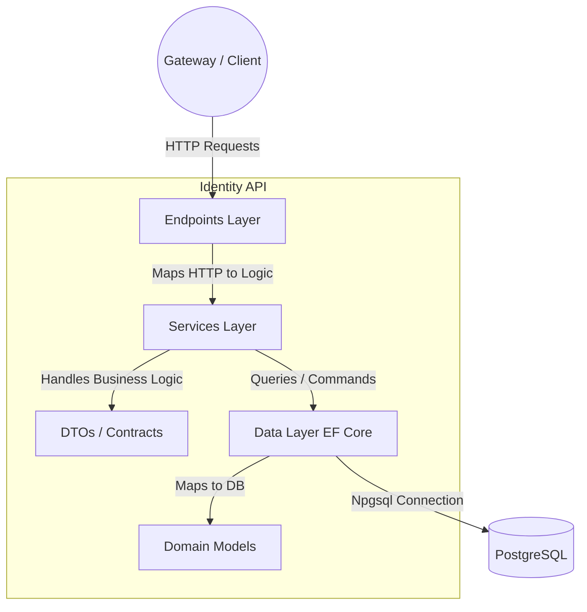
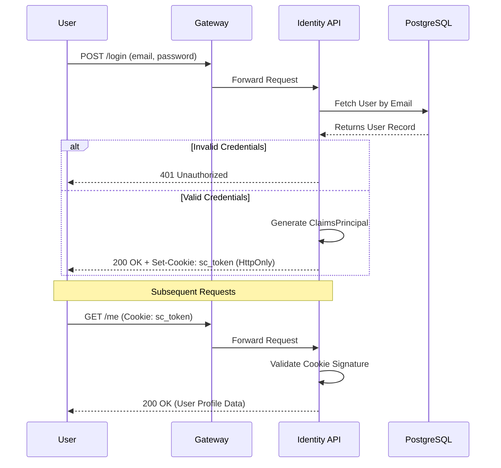

# Identity API: Architecture & Documentation

This document serves as the living report and technical documentation for the `.NET 8` Identity API and its Authentication/Authorization mechanisms within the ShiftCore Mission Control ecosystem.

---

## 1. System Architecture (Vertical Slice)

The API is built using a modern, feature-based **Vertical Architecture** inside a single ASP.NET Core project. This provides strict separation of concerns without the overhead of maintaining multiple class libraries.



### Layer Responsibilities:
- **`Endpoints/`**: Handles incoming HTTP routing (`/api/identity/v1/auth/*`) using Minimal APIs. Converts HTTP Context to strongly-typed DTOs.
- **`Services/`**: Contains interfaces (`IAuthService`) and implementations (`AuthService`) encapsulating the core business logic (e.g., verifying hashes, generating claims).
- **`DTOs/`**: Shared Data Transfer Objects ensuring a strictly enforced JSON envelope contract (`{ success, message, data }`) for the frontend.
- **`Data/` & `Models/`**: Entity Framework Core `DbContext` and domain entities. Handles direct persistence logic.

---

## 2. Authentication Flow

We utilize a highly secure **Cookie-Based Authentication** flow, leveraging ASP.NET Core's built-in Cookie Authentication schemes.



## 6. Seeded Users (Local Dev Only)

The release seed creates exactly one active Lead account:

| Email | Role | Purpose |
|---|---|---|
| `lead@shiftcore.local` | `Lead` | Release authentication fixture |

Password is set via the `SEED_LEAD_PASSWORD` environment variable at seed time.
**No password is committed to Git.** See README.md §Seed for the seed command.

team_id: `3b5f3ec5-cc27-4d68-8f4d-d80545d6b9c1` (matches Core release seed — DM-C06).

### Security Highlights:
- **`HttpOnly`**: The `sc_token` cookie cannot be read by client-side JavaScript (prevents XSS attacks).
- **`SameSite=Strict`**: Protects against Cross-Site Request Forgery (CSRF).
- **Claims-Based Authorization**: Standardized claims (`sub`, `email`, `role`, `teamId`) are generated during login and trusted across the ecosystem.

---

## 3. Database Schema

The `identity` schema lives in the shared `shiftcore` PostgreSQL database.
EF Core migrations (owned by this service) manage all DDL.

### `identity.users`

| Column | Type | Constraints |
|---|---|---|
| `id` | `UUID` | PK, `DEFAULT gen_random_uuid()` |
| `team_id` | `UUID` | `NOT NULL` |
| `full_name` | `VARCHAR(255)` | `NOT NULL` |
| `email` | `VARCHAR(255)` | `NOT NULL`, case-insensitive unique index `uq_user_email_ci` (DM-C01) |
| `password_hash` | `TEXT` | `NOT NULL` (BCrypt, cost 11) |
| `role` | `VARCHAR(50)` | `NOT NULL` |
| `is_active` | `BOOLEAN` | `NOT NULL DEFAULT TRUE` |
| `created_at` | `TIMESTAMPTZ` | `NOT NULL DEFAULT timezone('utc', now())` |
| `updated_at` | `TIMESTAMPTZ` | `NOT NULL DEFAULT timezone('utc', now())` |

### `identity.__EFMigrationsHistory`
Managed by EF Core. Records which migrations have been applied.

### Migration & Seed Strategy

Migrations are **never** applied automatically on startup.
Run explicitly after any schema change:

```bash
dotnet ef database update
```

Seed is an **idempotent explicit command** (not baked into migrations):

```bash
export SEED_LEAD_PASSWORD=<your-password>
dotnet run --project services/identity -- --seed
```

See [README.md](README.md) for the full local startup sequence.
